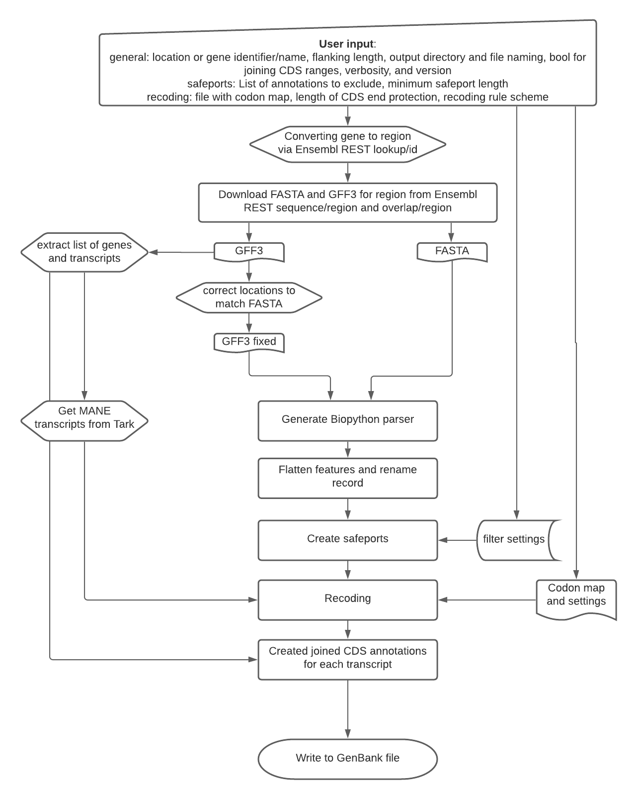
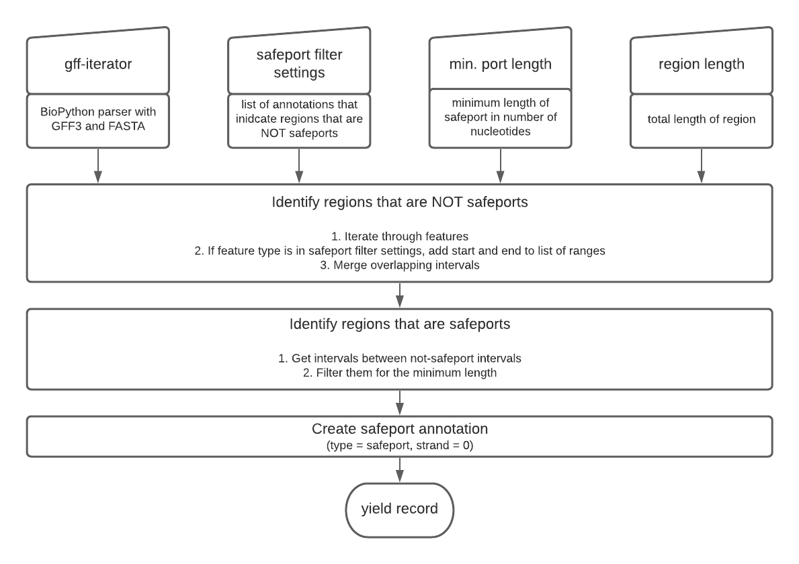
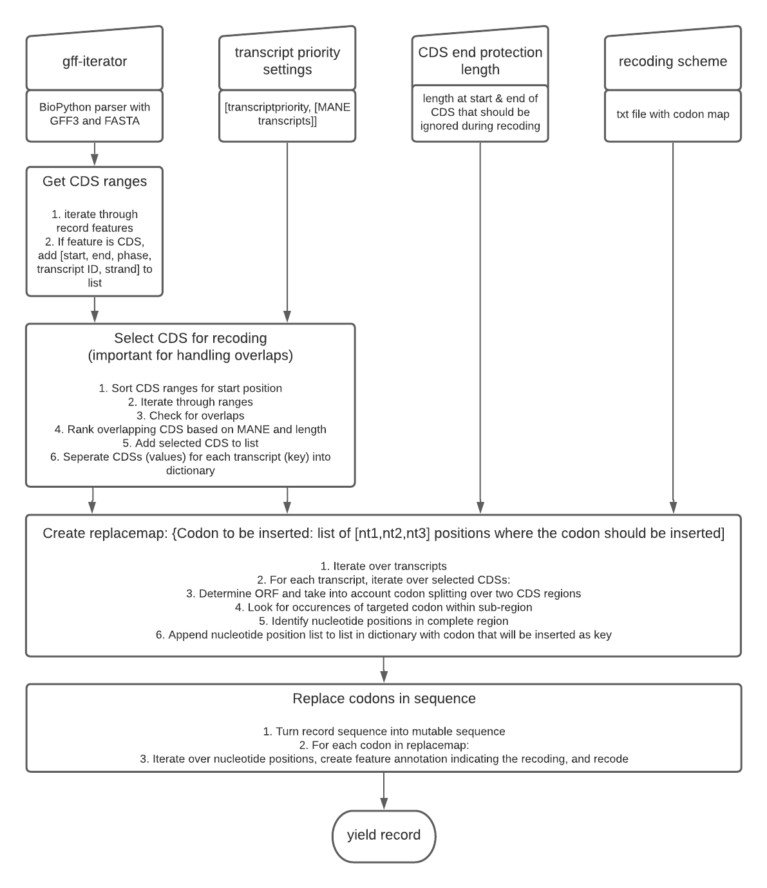

# Repository for the safeport and recoding (SPaRC) project

This project aims to annotate regions that are safe for gene editing (called safeports) and to to recode a genomic region by changing specific codons, e.g. replacing al GTA with GTT in the exons. Therefore, the script allows automated downloads of FASTA and gff from Ensemble via its REST API, annotates safeports, recodes the sequence and then creates a GenBank file. It mainly depends on BioPython for storing the sequence and annotation data. 

### Required modules
This code runs in Python 3. Please check requirements.txt for required modules and their versions.


### Usage

The tool can be executed using the following command line structure:
```
python main.py region [-v] [-f flank] [-o dir] [-n prefix] [-p annotation] [-l] [-c
FILE] [-e length] [-sm {max,soft,maneonly}] [-j True]
```


**positional arguments:**

region Either gene name/symbol or region of interest

**optional arguments:**

- -h, --help\
show this help message and exit
- -V, --version\
show program's version number and exit
- -v, --verbose\
Set logging level (default info)
- -f, --gene-flank\
Gene flanking region size (default 0)
- -o, --output-dir\
Output directory (default ./)
- -n, --output-prefix\
Output file prefix (default uses input region)
- -p, --safeport-filter\
List annotations that are NOT safeports (default 'ALL')
- -l, --safeport-length\
Minimum length for safeports (default 3nt)
- -c, --coding-file\
Optional codon mapping file
- -e, --endprotect\
Protect the end of each coding sequence by not modifying the last n nt
- -sm, --manestrength\
Choose 'max' (if none of the overlapping cds is a MANE transcript, the longest cds will be taken),'soft'(if none of the overlapping transcripts is a MANE, none will be recoded), or 'maneonly' (only MANE transcripts will be recoded).
- -j, --join\
If True, a joined CompoundLocation annotations will be created for each transcript.

### Encoded presumptions
- Organism is Human, assembly "GRCh38"
- REST API
    - Included features in GFF3 download:\
        - feature=regulatory;feature=cds;feature=exon;feature=variation;feature=repeat;\
        - variant_set=1kg_3_com (Variants genotyped by the 1000 Genomes project (phase 3) with frequency of at least 1%)
    - MANE transcripts: 
        - Use Ensembl ID for transcripts
- Safeports
    - Short names for list of annotations that are not region for safeports:
        - ALL: ['exon','CDS','CTCF_binding_site','promoter','sequence_variant','repeat_region','TF_binding_site']
        - noSNP: ['exon','CDS','CTCF_binding_site','promoter','repeat_region','TF_binding_site']
- Make GenBank file
    - Molecule type == 'DNA'
    - Taxonomy of Homo Sapiens

## Workflow

#### Downloading the GFF3 and FASTA file of a region or gene of interest: ensemble_rest.py

The user can either input a gene name/symbol or a region of interest. If a gene name or symbol is given, getENSEMBLGeneLoc queries ENSEMBL for the sequence location and returns the chromosome number, start, and end. If a “flanking” size is given, the region location is extended equally on both sides by that number of base pairs. Then, the ENSEMBL GFF and FASTA data is accessed via the function getENSEMBLGFF and getENSEMBLFASTA. The GFF3 and FASTA data for a specified region is accessed on https://rest.ensembl.org via “get overlap/region/species/region” and “get sequence/region/species/region”. To match the genomic co-ordinates in the GFF3 file with the region-only FASTA sequence, updateGFFRegions iterates through the GFF features and subtracts the start co-ordinate of the region from each annotation. \
The framework for reading the GFF3 file and converting it into a GenBank file is based on bcbio-gff (https://github.com/chapmanb/bcbb/blob/master/gff/Scripts/gff/gff_to_genbank.py).

For the handling of overlapping coding sequences during recoding, a list of MANE transcripts is required. The function getMANETranscripts imports them from the transcript archive Tark (http://devtark.ensembl.org/). Therefore, a list of genes within the defined genomic region is extracted from the
GFF3 file and the MANE transcripts for each gene is downloaded via “api/transcript/search/”.



#### Creating safeports: safeports.py
Safeports are created in regions that have no other relevant annotation via createSAFEPORTS. The default annotations taken into account for this are 'exon', 'CDS', 'CTCF_binding_site', 'promoter', 'sequence_variant’, 'TF_binding_site’ and ‘repeat_region'. The function getSAFERegions iterates through the sequencing record features by calling getDANGERRegions that creates a list of the annotated regions called danger_regions. Then, the regions between the danger_regions are added to a list of safe_regions, if they have the specified minimum length via invertRegions and filterRegions. For those safe_regions, a safeport annotation is created using createFEATUREannot.



### Recoding

The recode function replaces the codons based on codon_map in the sequence record, but protects nucleotides at the beginning or end of the coding sequence and handles overlaps based on a list of MANE transcripts. Even for coding sequences that are not overlapping, the user can choose to only
recode MANE transcripts by indicating “maneonly”. Otherwise, if overlaps occur, the MANE transcript is recoded preferably. If the “soft” option is chosen, no coding sequence is recoded if the overlapping coding sequences are not part of a MANE transcript. If the “max” option is chosen, the longer coding sequence will be recoded, even if it’s not a MANE transcript. First, the transcript id, start, end, phase and strand for each coding sequence is identified with getAnnotRange. Then, the coding sequences that are to be recoded are identified via selectCDS: this function looks for overlaps of the coding sequences and returns a list of CDS for recoding and a list of CDS that should be recoded but were in conflict with another MANE transcript CDS. Third, the sequences are searched for the target codon. getReplaceMapFor and getReplaceMapRev return the position and new nucleotide of the target nucleotides while taking into account the open reading frame and introns. The record sequence is then converted into a mutable sequence and the nucleotides are replaced by replaceCODON. Simultaneously, an annotation is created indicating the position and previous nucleotide before replacement.


